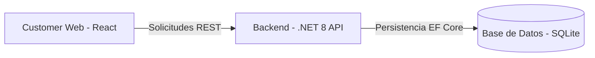
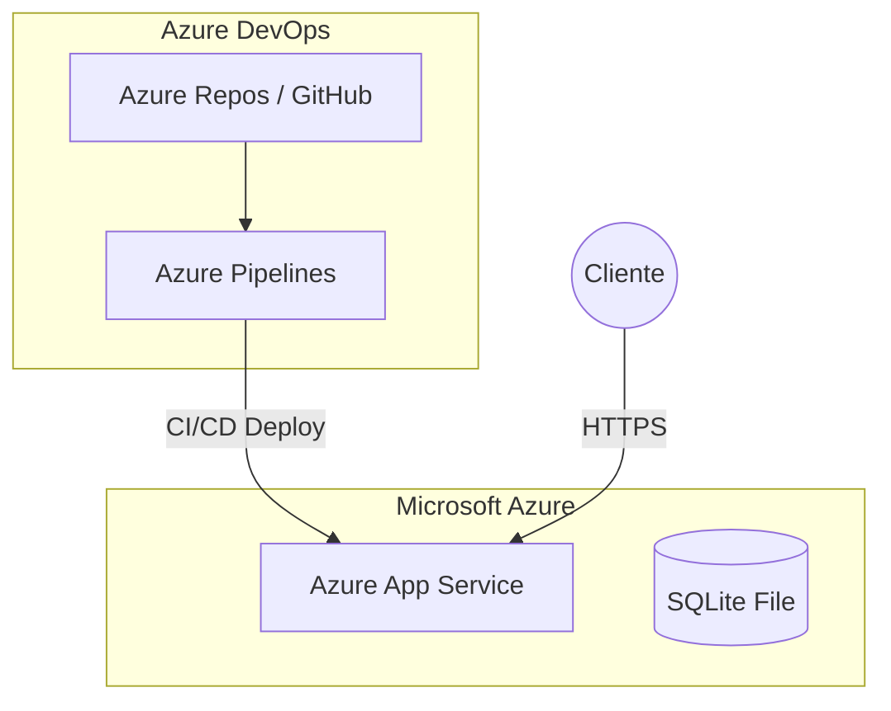

# PruebaTecnica

# Sistema de Gestión de Visitas Técnicas "Electra Field"

Este proyecto es una solución integral para la gestión de servicios técnicos residenciales de la empresa **Electra**, enfocada en optimizar la atención en Santiago de Cali mediante la reducción de visitas fallidas y la mejora de la experiencia del cliente.

---

## 1. Solución Propuesta (Descripción de Alto Nivel)
La plataforma permite a los usuarios residenciales (Estratos 1-3+) autogestionar sus citas técnicas. Se basa en una arquitectura desacoplada que garantiza escalabilidad y facilidad de mantenimiento.

### Diagrama Conceptual Simple

## 2. Product Backlog (Azure Boards)

Se definieron las siguientes User Stories en Azure Boards para guiar el desarrollo ágil del producto:

    US1: Registro y Gestión de Clientes: Como Operador de Electra, quiero registrar a los usuarios con su NIC y nombre completo para que puedan acceder al sistema de agendamiento de citas técnicas. 

    US2: Validación de acceso por NIC: Como Cliente residencial, quiero ingresar mi NIC en el buscador para verificar que mis datos existen en el sistema antes de proceder con el agendamiento. 

    US3: Agendamiento autónomo de citas: Como Cliente, quiero seleccionar una fecha en el calendario y una jornada (Mañana/Tarde) para programar una visita técnica en mi domicilio. 

    US4: Prevención de cruces de agenda: Como Sistema de Electra, quiero impedir que se agenden dos citas para el mismo NIC en la misma fecha y jornada para optimizar los recursos y evitar visitas fallidas. 

## 3. Tecnologías Usadas

- Frontend: React 18 con componentes funcionales y Hooks.

- Backend: ASP.NET Core 8 (C#) con Arquitectura N-Capas.

- Base de Datos: SQLite (Cumpliendo el RNF de portabilidad).

- DevOps: Azure DevOps (Boards, Repos, Pipelines).
  
- Infraestructura: Azure App Service (Linux).
  
- Pruebas Unitarias: xUnit con 100% de éxito en lógica de negocio.

- Contenedores: Docker y Docker Compose para orquestación local.

## 4. Calidad de Software

Se implementó una suite de pruebas unitarias utilizando xUnit para garantizar la integridad de la lógica de agendamiento.

- Casos probados: Validación de datos completos, rechazo de NICs vacíos y restricción de fechas pasadas.

  - Ejecución:
    
        dotnet test

  - Resultado: 3 pruebas superadas exitosamente.

### 5. Arquitectura de Despliegue (Azure)

La solución utiliza un flujo de Integración y Despliegue Continuo (CI/CD) para garantizar la entrega de valor constante.

## 6. Dockerización

La solución cuenta con la configuración necesaria para ser contenedorizada, garantizando portabilidad absoluta. Se entregan el Dockerfile y docker-compose.yaml optimizados con Multi-stage builds. Esto permite que cualquier equipo con Docker instalado pueda desplegar la solución completa sin configurar entornos locales.

- Ejecución con Docker Compose:

        docker-compose up --build

## 7. Instrucciones de Ejecución Local
Backend (.NET 8)

- Navegar a la carpeta PruebaTecnicaBack.

- Restaurar paquetes: dotnet restore.

- Ejecutar: dotnet run --project Electra.Api/. La API estará disponible en http://localhost:5150.

Frontend (React)

- Navegar a la carpeta PruebaTecnicaFront.

- Instalar dependencias: npm install.

- Ejecutar: npm start. La web abrirá en (http://localhost:5173/)

## 8. Funcionalidades Implementadas

    [x] Formulario de ingreso por NIC.

    [x] Selector de fecha y jornada AM/PM.

    [x] Validación de existencia de cliente en base de datos.

    [x] Puntos Extra: Pipeline de CI/CD configurado en Azure DevOps.

    [x] Puntos Extra: Estructura de Monorepo para gestión centralizada.

## 9. Limitaciones Conocidas
  
- Autenticación: El acceso se basa exclusivamente en el NIC del cliente para facilitar el uso residencial.
  
- Infraestructura Cloud: El despliegue automatizado mediante Pipelines se encuentra configurado pero pausado debido a limitaciones de cuota de paralelismo en la suscripción de Azure. Se
priorizó la entrega de un código limpio, testeado y funcional de manera local.

- Entorno Docker: Si bien se entregan los archivos de orquestación, la ejecución final depende de la habilitación de virtualización en el host de despliegue.

## 10. Gestión del Proyecto (Azure Boards)

La planificación se realizó bajo metodologías ágiles.

- Enlace al Board: https://dev.azure.com/miguelzg1911/PruebaTecnica-Celsia/_workitems/edit/5/

Desarrollado por: Miguel Ángel Zapata Gutiérrez
