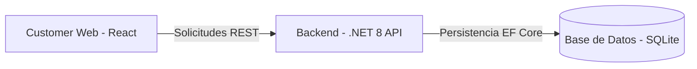

# PruebaTecnica

# Sistema de Gestión de Visitas Técnicas "Electra Field"

Este proyecto es una solución integral para la gestión de servicios técnicos residenciales de la empresa **Electra**, enfocada en optimizar la atención en Santiago de Cali mediante la reducción de visitas fallidas y la mejora de la experiencia del cliente.

---

## 1. Solución Propuesta (Descripción de Alto Nivel)
La plataforma permite a los usuarios residenciales (Estratos 1-3+) autogestionar sus citas técnicas. Se basa en una arquitectura desacoplada que garantiza escalabilidad y facilidad de mantenimiento.

### Diagrama Conceptual Simple

2. Product Backlog (Azure Boards)

Se definieron las siguientes User Stories en Azure Boards para guiar el desarrollo ágil del producto:

    US1: Registro de Clientes: Como Operador, quiero registrar clientes con su NIC para habilitar su acceso al sistema.

    US2: Validación de Identidad: Como Cliente, quiero ingresar mi NIC para validar que mis datos son correctos antes de agendar.

    US3: Agendamiento Autónomo: Como Cliente, quiero seleccionar fecha y jornada (AM/PM) para programar mi visita de forma rápida.

    US4: Control de Disponibilidad: Como Sistema, quiero evitar cruces de agenda para optimizar los costos de visitas fallidas.

3. Tecnologías Usadas

    Frontend: React 18 con componentes funcionales y Hooks.

    Backend: ASP.NET Core 8 (C#) con Arquitectura N-Capas.

    Base de Datos: SQLite (Cumpliendo el RNF de portabilidad).

    DevOps: Azure DevOps (Boards, Repos, Pipelines).

    Infraestructura: Azure App Service (Linux).

4. Arquitectura de Despliegue (Azure)

La solución utiliza un flujo de Integración y Despliegue Continuo (CI/CD) para garantizar la entrega de valor constante.
